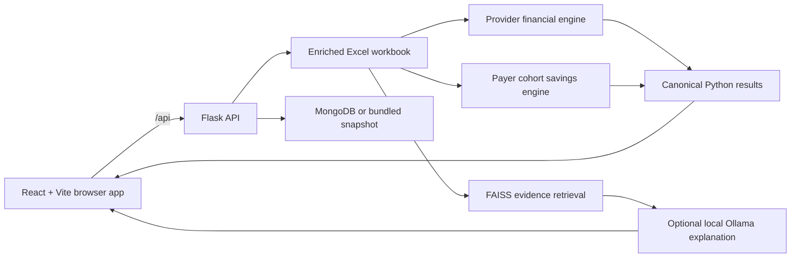

# PayerPayee

PayerPayee is a claims-financial analytics application for exploring members, claims, provider revenue forecasts, and rule-based payer savings opportunities. The browser application is built with React and Vite; a Flask API loads the enriched claims workbook, runs deterministic Python calculations, and optionally uses local retrieval and Ollama for evidence-grounded explanations.

> This project is claims-utilisation and financial decision support. It is not clinical advice, does not determine medical necessity, and should not be used to infer that care was unnecessary or preventable.

## Contents

- [What the application does](#what-the-application-does)
- [Prediction perspectives](#prediction-perspectives)
- [Architecture](#architecture)
- [Data sources](#data-sources)
- [Payer cohort savings rules](#payer-cohort-savings-rules)
- [Repository map](#repository-map)
- [Prerequisites](#prerequisites)
- [Quick start](#quick-start)
- [Configuration](#configuration)
- [API overview](#api-overview)
- [Testing and quality checks](#testing-and-quality-checks)
- [Build and deployment](#build-and-deployment)
- [Optional local AI and RAG](#optional-local-ai-and-rag)
- [Utility projects](#utility-projects)
- [Troubleshooting](#troubleshooting)
- [Data and security notes](#data-and-security-notes)

## What the application does

The main interface provides:

- An executive claims dashboard with financial totals, filters, and recent claims.
- A claims directory and detailed adjudication view.
- Member 360 search with all available member encounters and client-side pagination.
- Provider-side financial forecasting for a selected claim and disease episode.
- A full-page Payer Savings Prediction modal anchored to the selected claim.
- Rule-based peer selection, benchmark construction, calculation traces, confidence, and supporting workbook evidence.
- Prediction scenario directories, risk queues, validation summaries, and provider opportunity details.
- Optional claim-scoped explanations grounded in retrieved workbook evidence.

The primary financial calculations are deterministic. Python produces the canonical numbers returned by the API; React formats and displays them.

## Prediction perspectives

PayerPayee keeps two financial perspectives separate:

| View | Question answered | Primary output | Engine |
| --- | --- | --- | --- |
| Provider Revenue Forecast | What payment, adjustment, denial, recovery, or repeat-service exposure could affect the provider? | Provider-side financial forecast and opportunities | Deterministic Python provider/financial engines |
| Payer Savings Prediction | How much payer spend differs from a matched lower-utilisation or lower-spend cohort benchmark? | Predicted Payer Avoidable Spend | Deterministic Python payer cohort engine |

Provider underpayment or recoverable revenue is not treated as payer savings. The payer calculation uses `Paid_Amount` as actual payer spend.

## Architecture



The normal request path is:

1. The user selects a current claim in React.
2. React sends the claim ID to Flask.
3. Flask resolves the claim from the configured data source.
4. A Python engine builds the relevant episode, peers, benchmarks, calculations, and evidence.
5. Flask returns one canonical result object.
6. React renders the result without recalculating money.

Ollama and FAISS do not select scenarios or calculate financial amounts. Payer predictions remain available when Ollama is offline.

## Data sources

### 1. Enriched workbook

The configured workbook is the preferred source for detailed prediction and Member 360 workflows. By default, the application uses:

```text
data/claims-demo.xlsx
```

Set `SAVINGS_WORKBOOK_PATH` to use another workbook. The workbook loader requires these sheets by default:

- `837_Claims`
- `834_Eligibility`
- `Reason_Code_Legend`
- `New_Fields_Dictionary`
- `Data_Notes_READ_ME`

The sheet names can be changed through environment variables.

Rows with `Is_Historical_Reference_Record = Y` are retained as historical evidence and peer records. They are excluded from selectable current claims and current-member encounter lists.

The loader records workbook hashes, source-row hashes, import time, calculation version, prediction version, and evidence metadata for traceability. Its in-process cache is invalidated when the workbook changes.

### 2. MongoDB

MongoDB supports the general application query layer and non-workbook fallback workflows. Defaults:

```text
URI:      mongodb://localhost:27017/
Database: PayerPayee
```

Run `npm run import:mongo` to import the configured CSV into MongoDB. If MongoDB is reachable but empty, the application can seed it from the bundled claim snapshot.

### 3. Bundled snapshot

If MongoDB is unavailable, the query layer falls back to:

```text
frontend/public/data/claims-fallback.json
```

This snapshot keeps the basic dashboard and claim/member browsing usable. Workbook-only cohort predictions still require a valid configured workbook.

### Source precedence

- Workbook-aware endpoints use `SAVINGS_WORKBOOK_PATH`, or the bundled workbook when no path is set.
- General Mongo-backed endpoints connect to MongoDB and fall back to the bundled JSON snapshot when necessary.
- Browser cache may improve initial display speed, but it is not an authoritative source for financial calculations.

## Payer cohort savings rules

The Payer Savings Prediction is a rule-based engine, not an ML prediction.

### Claim-anchored episode

The selected claim supplies its member, ICD-10 family, and service date. The engine finds the rolling disease episode containing that claim. The default episode gap is 90 days (`PAYER_COHORT_EPISODE_DAYS=90`). It does not combine every disease episode from the member's full history.

### Scenario selection

Every peer must have a different `Member_ID` from the target member. Scenarios are evaluated in priority order:

1. **Strict Match** — same ICD-10 family, payer, provider/location proxy, CPT or procedure family, place of service, and similar units.
2. **Same ICD-10 Family + Same Payer** — disease family and payer match; provider, procedure, place of service, and units may differ.
3. **Same ICD-10 Family Only** — disease family matches; payer and all other comparison fields may differ.

The first available scenario is selected. The engine does not invent peers; it returns an error if no different-member cohort is available after all three scenarios.

### Benchmarks and calculation

The selected peer episodes are used to build:

- A lower-utilisation claim-count benchmark.
- A qualifying lower-spend payer benchmark when available.
- Q25, median, and Q75 peer paid-per-claim values.
- An auditable list of peer members, peer episodes, and claim rows.

The current calculation exposes two opportunities:

```text
utilisation opportunity = excess claims x median peer paid per claim

payer-spend opportunity = max(target payer spend - lower-spend benchmark, 0)

final prediction = min(target payer spend,
                       max(utilisation opportunity, payer-spend opportunity))
```

The output includes a benchmark-based range, confidence score and level, formula trace, zero-result reason, and the exact workbook evidence used. A zero prediction is a calculated result, not a substitute for missing peers or a failed calculation.

### Full-page result

The Payer Savings Prediction modal contains four main sections:

1. Benchmark Summary
2. Peer Members Used
3. Prediction Range / Calculation Summary
4. Supporting Evidence

The target member is never presented as an external peer. Evidence roles identify target episode claims, benchmark evidence, and other matched peer claims.

## Provider financial forecast

The provider-side engine is separate from payer cohort savings. It:

- Validates and normalizes canonical claim fields.
- Builds member and diagnosis-family episodes.
- Selects historical peers through a progressively broader hierarchy.
- Forecasts allowed amount, provider payment, patient responsibility, and contractual adjustment.
- Estimates denial and repeat-service exposure.
- Evaluates evidence-gated recovery and provider opportunity categories.
- Produces validation, reconciliation, confidence, action, and supporting-evidence data.

The workbook financial engine also supplies claim-specific adjudication reasons and traceable evidence. Optional LLM output may explain the canonical result, but cannot replace or alter its amounts.

## Repository map

| Path | Purpose |
| --- | --- |
| `frontend/` | React UI, styles, Vite configuration, static fallback data, and frontend formatting tests |
| `frontend/src/App.jsx` | Main single-page interface, routing, workspaces, modals, tables, and result rendering |
| `backend/app.py` | Flask application, API routes, source selection, error handling, and production static serving |
| `backend/workbook_enrichment.py` | Workbook validation, normalization, current/reference separation, caching, and source metadata |
| `backend/payer_prediction.py` | Claim-anchored payer cohort scenario, benchmark, savings, range, confidence, and evidence calculations |
| `backend/provider_prediction.py` | Provider episode construction, peer hierarchy, forecasts, risk, validation, and opportunity payloads |
| `backend/financial_engine.py` | Deterministic claim-specific provider financial result and adjudication opportunity logic |
| `backend/claim_patterns.py` | Cutoff-safe historical matching, similarity, repeat patterns, and peer evidence |
| `backend/prediction_validation.py` | Prediction consistency checks and retrospective validation reports |
| `backend/workbook_rag.py` | Workbook-only FAISS document creation, indexing, scoped retrieval, and evidence ranking |
| `backend/workbook_llm.py` | Evidence-grounded explanations and claim-scoped chat with numeric validation |
| `backend/ollama_service.py` | Local Ollama health, embedding, and chat client |
| `backend/db.py` | MongoDB connection, retry behavior, initial seeding, and bundled-snapshot fallback |
| `backend/claim_mapper.py` | Claim normalization and member document construction |
| `backend/import_claims.py` | CSV-to-MongoDB import command |
| `backend/export_fallback.py` | Bundled fallback-data export command |
| `backend/tests/` | Backend unit, rule-engine, modal-contract, RAG, validation, and design tests |
| `shared/predictionEngine.js` | Shared JavaScript prediction utilities used by older/fallback paths |
| `data/claims-demo.xlsx` | Bundled demonstration workbook |
| `payer_payee_mongodb/` | Isolated local MongoDB utility project on port 27018 |
| `prediction_llm/` | Standalone local member/claim analytics service on port 8765 |
| `render.yaml` | Render build, start, and environment configuration |

## Prerequisites

- Python 3.12 recommended; Render is configured for Python 3.12.8.
- Node.js `^20.19.0` or `>=22.12.0`.
- npm.
- MongoDB is optional for workbook-first development because a bundled fallback snapshot is available.
- Ollama is optional unless local explanations or RAG indexing are needed.

## Quick start

From the repository root:

```bash
python3 -m venv .venv
source .venv/bin/activate
pip install -r backend/requirements.txt

npm ci
cp .env.example .env
npm run dev:all
```

Open [http://localhost:5173](http://localhost:5173). The development services are:

- Frontend: `http://localhost:5173`
- Backend: `http://localhost:4000`
- Backend health: `http://localhost:4000/health`

The Vite development server proxies `/api` and `/health` to port 4000.

### Run the services separately

Backend:

```bash
source .venv/bin/activate
npm run backend
```

Frontend, in another terminal:

```bash
npm run frontend
```

### Use a different workbook

Edit `.env`:

```dotenv
SAVINGS_WORKBOOK_PATH=/absolute/path/to/enriched-claims.xlsx
```

Restart the backend after changing configuration. The workbook must include all required sheets, claim IDs, member IDs, and the fields needed by the selected prediction workflow.

## Configuration

Copy `.env.example` to `.env`. `.env` files are ignored by Git.

### Core service settings

| Variable | Default/example | Description |
| --- | --- | --- |
| `PORT` | `4000` | Flask/gunicorn port |
| `CORS_ORIGIN` | local and deployed URLs | Comma-separated allowed browser origins |
| `MONGODB_URI` | `mongodb://localhost:27017/` | MongoDB connection URI |
| `MONGODB_DB` | `PayerPayee` | Main MongoDB database |
| `MONGODB_TIMEOUT_MS` | `5000` | MongoDB connection timeout |
| `MONGODB_RETRY_SECONDS` | `60` | Delay before retrying MongoDB after fallback |
| `CSV_PATH` | local CSV path | Source used by the Mongo import and older provider fallback path |

### Workbook settings

| Variable | Default | Description |
| --- | --- | --- |
| `SAVINGS_WORKBOOK_PATH` | `data/claims-demo.xlsx` | Enriched workbook used by workbook-aware endpoints |
| `CLAIMS_WORKSHEET_NAME` | `837_Claims` | Claims sheet |
| `ELIGIBILITY_WORKSHEET_NAME` | `834_Eligibility` | Eligibility sheet |
| `REASON_LEGEND_WORKSHEET_NAME` | `Reason_Code_Legend` | Adjudication reason legend |
| `FIELD_DICTIONARY_WORKSHEET_NAME` | `New_Fields_Dictionary` | Field dictionary |
| `DATA_NOTES_WORKSHEET_NAME` | `Data_Notes_READ_ME` | Workbook notes |

### Prediction settings

| Variable | Default | Description |
| --- | --- | --- |
| `PROVIDER_EPISODE_WINDOW_DAYS` | `90` | Provider episode gap/window |
| `PROVIDER_MIN_PEERS` | `5` | Preferred provider peer minimum |
| `PAYER_COHORT_EPISODE_DAYS` | `90` | Payer disease comparison window |
| `PAYER_SCENARIO1_UNIT_TOLERANCE` | `1` | Strict-scenario unit similarity tolerance |
| `REPEAT_PRIOR_STRENGTH` | `8` | Repeat-rate smoothing strength |
| `PREDICTION_PRIOR_STRENGTH` | `8` | Financial forecast smoothing strength |
| `AVOIDABLE_PRIOR_STRENGTH` | `8` | Avoidable-spend smoothing strength |
| `AVOIDABLE_MIN_HIERARCHY_PEERS` | `3` | Minimum preferred peers for avoidable-spend hierarchy |

### Optional AI and retrieval settings

| Variable | Default | Description |
| --- | --- | --- |
| `LLM_PROVIDER` | `ollama` | Explanation provider |
| `OLLAMA_BASE_URL` | `http://127.0.0.1:11434` | Ollama server URL |
| `OLLAMA_CHAT_MODEL` | `gemma3` | Local explanation model |
| `OLLAMA_EMBED_MODEL` | `embeddinggemma` | Local embedding model |
| `RAG_INDEX_DIR` | `backend/.rag_index` | Generated FAISS index directory |
| `RAG_AUTO_BUILD` | `true` | Build an index at startup when embeddings are available |
| `ENABLE_RAG_ADMIN` | `false` | Enables the protected-by-configuration rebuild endpoint |
| `RAG_TOP_K` | `8` | Maximum retrieved evidence set |

`GROQ_*` variables remain for legacy/provider compatibility paths. The current local workbook explanation flow defaults to Ollama.

## API overview

All responses are JSON except the production frontend assets.

### Claims and members

| Method | Route | Purpose |
| --- | --- | --- |
| `GET` | `/health` | Active source and service health |
| `GET` | `/api/claims` | Paginated claims with search and filters |
| `GET` | `/api/claims/{claim_id}` | One selectable claim |
| `GET` | `/api/members` | Paginated member directory |
| `GET` | `/api/members/{member_id}` | Member summary and payer cohort totals |
| `GET` | `/api/members/{member_id}/claims` | All current claims for a member |
| `GET` | `/api/dashboard` | Dashboard totals, filters, and recent claims |

Common claim query parameters include `page`, `limit`, `search`, `payer`, `plan`, `providerGroup`, `status`, `from`, and `to`. Workbook claim requests also accept `includeFinancial` and `compact`.

### Payer cohort prediction

| Method | Route | Purpose |
| --- | --- | --- |
| `GET` | `/api/predictions/payer/options` | Available members, disease families, and episodes |
| `GET` or `POST` | `/api/predictions/payer/claim/{claim_id}` | Generate a claim-anchored payer savings result |
| `POST` | `/api/predictions/payer/generate` | Generate from `member_id`, `diagnosis_family`, and `comparison_episode_id` |
| `GET` | `/api/predictions/payer/member/{member_id}` | Aggregate non-overlapping episode results for one member |
| `GET` | `/api/predictions/payer/portfolio` | Aggregate payer cohort results across selectable members |

Example:

```bash
curl http://localhost:4000/api/predictions/payer/claim/CLM00001092
```

### Provider prediction and explanation

| Method | Route | Purpose |
| --- | --- | --- |
| `GET` | `/api/predictions/scenarios` | Provider-facing scenario directory and totals |
| `GET` | `/api/predictions/provider-case/{claim_id}` | Canonical provider financial forecast |
| `POST` | `/api/predictions/provider-case/{claim_id}/llm` | Optional evidence-grounded explanation |
| `POST` | `/api/provider-llm/chat` | Claim- and episode-scoped follow-up question |
| `GET` | `/api/predictions/validation` | Retrospective validation report |
| `GET` | `/api/predictions/risk-queue` | Paginated prediction risk queue |
| `GET` | `/api/predictions/claims/{claim_id}` | Basic/stored claim risk prediction |

### AI and retrieval operations

| Method | Route | Purpose |
| --- | --- | --- |
| `GET` | `/api/ai/health` | Ollama, model, prediction, and RAG status |
| `POST` | `/api/rag/rebuild` | Force a RAG rebuild when `ENABLE_RAG_ADMIN=true` |

## Testing and quality checks

Run all maintained tests:

```bash
npm test
```

Run suites independently:

```bash
npm run test:backend
npm run test:frontend
```

Run lint and a production build:

```bash
npm run lint
npm run build
```

Backend tests cover provider forecasts, workbook calculations, payer cohort rules and modal contracts, avoidable-spend behavior, prediction design boundaries, and optional Ollama/RAG behavior. The frontend test protects provider result formatting and display contracts.

## Build and deployment

Create the frontend bundle:

```bash
npm run build
```

Vite writes the bundle to `dist/`. Flask serves that directory in production, including single-page application route fallback.

Run the production server locally:

```bash
source .venv/bin/activate
npm run build
npm run backend:start
```

Render deployment is configured in `render.yaml`:

- Install Python dependencies.
- Install Node dependencies.
- Build the frontend.
- Start `gunicorn backend.app:app` on Render's assigned port.

Set production secrets and connection values in the hosting environment. Do not use a localhost MongoDB URI on Render; use a hosted MongoDB service if MongoDB-backed endpoints are required.

## Optional local AI and RAG

The application can retrieve workbook evidence with FAISS and ask a local Ollama model to explain the deterministic result.

Install and start Ollama, then obtain the configured models:

```bash
ollama pull gemma3
ollama pull embeddinggemma
```

Build the workbook index:

```bash
source .venv/bin/activate
python -m backend.workbook_rag build
```

Check readiness:

```bash
curl http://localhost:4000/api/ai/health
```

Generated indexes are stored under `backend/.rag_index/` and are ignored by Git. See [OLLAMA_RAG_SETUP.md](OLLAMA_RAG_SETUP.md) for the complete setup and failure behavior.

## Utility projects

Two self-contained helpers live in the repository but are not required to start the main application.

### Isolated raw-workbook MongoDB

[`payer_payee_mongodb/`](payer_payee_mongodb/) runs a separate local MongoDB instance on `127.0.0.1:27018`. It preserves raw workbook headings in `payer_payee.837_claims` and includes validation and connection scripts. Its database is intentionally separate from the main application's default port 27017 database.

### Standalone Prediction LLM

[`prediction_llm/`](prediction_llm/) is a local service on port 8765 for claim/member summaries and evidence-grounded questions over the isolated MongoDB dataset. It uses deterministic analytics first and a local Ollama model only for explanation.

## Troubleshooting

### The frontend loads but API calls fail

Confirm the backend is running on port 4000:

```bash
curl http://localhost:4000/health
```

During development, access the UI through port 5173 so Vite can proxy API calls.

### The backend says the frontend build is missing

The Flask production route requires `dist/index.html`:

```bash
npm run build
```

For normal development, use `npm run dev:all` and open port 5173.

### A payer prediction returns 409 or 422

- `409` generally means a valid workbook is not configured.
- `422` generally means the selected claim/episode cannot produce a valid different-member cohort after all scenarios.

Confirm the workbook path, required sheets, `Member_ID`, `ICD10_Family`, service dates, `Paid_Amount`, and historical-reference rows.

### MongoDB is unavailable

The application logs a warning and uses the bundled snapshot for supported query endpoints. To use MongoDB, start a server on port 27017 or update `MONGODB_URI`, then restart the backend.

### Ollama is unavailable

Core Python predictions continue to work. Explanations and embedding-based retrieval may be unavailable. Check `/api/ai/health`, the Ollama service, and the configured model names.

### Workbook changes do not appear

Restart the backend after replacing the workbook. The loader keys its cache by the resolved path, modification time, and file size, and refreshes calculation/RAG caches when the workbook hash changes.

## Data and security notes

- Treat source workbooks, exports, logs, and generated reports as sensitive claims data.
- Do not commit real credentials or protected health information. `.env`, generated indexes, virtual environments, build output, and common logs are ignored by Git.
- The repository does not currently implement an authentication layer; add access control before exposing it to untrusted networks.
- The RAG pipeline is evidence retrieval only. Do not expose raw embeddings or vector contents through the UI.
- Validate workbook field definitions and payer/provider contracts before using financial outputs operationally.
- No license file is currently included in this repository.

## Additional documentation

- [OLLAMA_RAG_SETUP.md](OLLAMA_RAG_SETUP.md) — local Ollama and FAISS setup.
- [PROVIDER_LLM.md](PROVIDER_LLM.md) — provider prediction/explanation implementation notes, including legacy compatibility details.
- [payer_payee_mongodb/README.md](payer_payee_mongodb/README.md) — isolated MongoDB helper.
- [prediction_llm/README.md](prediction_llm/README.md) — standalone local analytics service.
